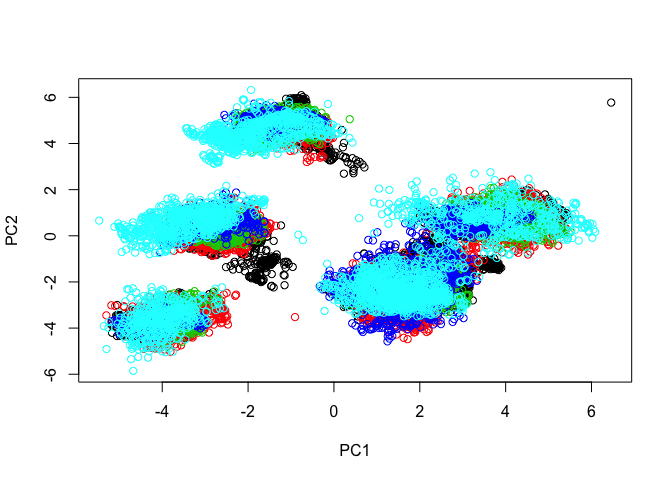
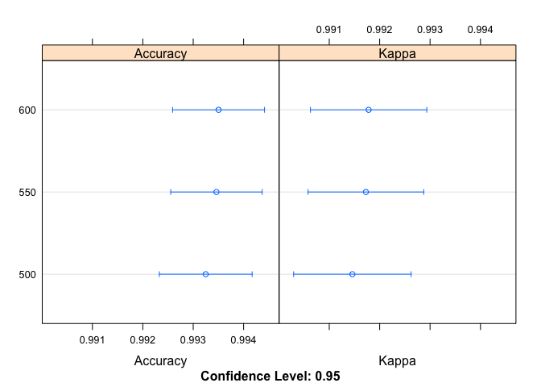

Final Project: Identifying Qualitative Performance Category in Weight Lifting Exercise with Machine Learning Algorithm
================
Andrew Nix
4/20/2017

Introduction
============

The goal of this project is to accurately predict the manner in which a weight lifting exercise was performed based on a wide range of accelerometer- measures gathered across six subject. Details about the study and the data set can be found here: \*<http://groupware.les.inf.puc-rio.br/har*>. A random forrest model was generated based on a training data set consisting of 160 features (eventually narrowed down to 53 features after data cleaning was completed) and 19,622 observations across 6 subjects. The model achieved an in-sample accuracy level of over 99%. The model's out-of-sample error was also estimated based on cross validation measures and the use of a segregated "validation" data set (20% of the original "training set"), and found to meet the 99% accuracy threshold as well.
The model was then applied to a "testing" data set where the actual performance categories were unknown.

Data Loading and Overview
=========================

The data and the necessary libraries were loaded and a review of the training set was conducted (in the interest of brevity details not included here).

The code used to load the csv files is below.

``` r
## Library Loading 
#### Data loading ####
Accelo_Training  <- read.csv('https://d396qusza40orc.cloudfront.net/predmachlearn/pml-training.csv', 
                             na.strings=c('#DIV/0', '', 'NA') ,stringsAsFactors = F)

Accelo_Testing  <- read.csv('https://d396qusza40orc.cloudfront.net/predmachlearn/pml-testing.csv',
                            na.strings= c('#DIV/0', '', 'NA'),stringsAsFactors = F)
```

Data Cleaning
=============

It was recognized that a large number of columns consisted almost entirely of NA values. These columns were deemed to be unhelpful to the data analysis and were removed.

``` r
## check NA count by column

na_count <-sapply(Accelo_Training, function(y) sum(length(which(is.na(y)))))
# na_count

## 100 of the 160 columns are missing 19216 observations (out of hte total of 19622 observations).  I went ahead and removed these columns from the dataset with the following code

NA_ColNames <- names(sapply(na_count[na_count>10000], names))

Accelo_Training<- Accelo_Training[setdiff(names(Accelo_Training),NA_ColNames)]
```

In addition, seven other variables (X, user\_name,raw\_timestamp\_part\_1, raw\_timestamp\_part\_2, cvtd\_timestamp, new\_window and num\_window) were judged to be not appropriate for inclusion in my model for the following reasons: 1) they are not directly associated with the phenomenon of interest (e.g. the identify of the subject should not matter in the prediction); and
2) their inclusion risked an increase in out-of-sample error (e.g. the identity of the subject may help predict outcomes in the sample but would not be helpful for predictions involving other subjects).

``` r
Accelo_Training_Analysis <-Accelo_Training[,-(1:7)]
```

Exploratory Analysis
====================

A correlation matrix was generated to examine the relationships among the variables. The subset of correlations that are above 0.90 are shown below.

    ##                  Var1             Var2     value
    ## 2635     accel_belt_y        roll_belt 0.9248983
    ## 2636        roll_belt     accel_belt_y 0.9248983
    ## 2637     accel_belt_y total_accel_belt 0.9278069
    ## 2638 total_accel_belt     accel_belt_y 0.9278069
    ## 2639  gyros_forearm_z gyros_dumbbell_z 0.9330422
    ## 2640 gyros_dumbbell_z  gyros_forearm_z 0.9330422
    ## 2649 total_accel_belt        roll_belt 0.9809241
    ## 2650        roll_belt total_accel_belt 0.9809241

Although a large number of highly correlated variables were identified, all variables were still retained at this stage. This choice was made in order to maximize the predictive power in the event that a model was chosen that is largely unaffected by issues of multi-collinearity (such as random forrest-based model).

Relationships among individual features, as well as amongst multiple features (via principle component analysis, combining weighted combinations of individual predictors into components), failed to distinguish the "classe" groups. See the below PCM plot for an illustration of this finding.



The colors, representing the individual classe groups, almost entirely overlap each other in a plot of the top 2 principle components. This suggests that these components, by themselves, only have limited predictive power for the classe variable.

For these reasons, I decided to focus on an approach that emphasized predictive accuracy rather than on the influence of individual predictors.

Model Selection
===============

A random forrest model was selected as the method for training the data set due to it's well-established reputation for accuracy in categorical prediction.

The first iteration of a random forrest model using default paramaters was found to have both Accuracy and Kappa values above 0.99 and an optimal mtry value of 2 (based on the default setting for *ntree*, i.e. number of trees is 500).

The final iteration (presented below) was essentially unchanged from this first version of th emodel. The only real adjustment to the code was to incorporate parallel processing to improve model efficiency. This proved to be a very effective approach, as the model run time (as evidence by the log data also provided by the code) improved by around 3000% with these changes.

``` r
## Configure parallel processing and trainControl object

cluster <- makeCluster(detectCores() - 1) # convention to leave 1 core for OS
registerDoParallel(cluster)

fitControl <- trainControl(method = "cv",
                           number = 10,
                           allowParallel = TRUE)

## Training model incorporating trainControl settings for parallel processing 

Rprof ( templog <- tempfile(),  memory.profiling = TRUE )
seed<-2222 
set.seed(seed)
control <- trainControl(method="repeatedcv", number=10, repeats=3)
RF_Default_Fit <-train(x = Accelo_training[,-53], y = Accelo_training$classe,method="rf",
##,metric=metric, tuneGrid=tunegrid,
trControl=fitControl)

## De-register parallel processing cluster upon completion of the main query used to build the model 

stopCluster(cluster)
registerDoSEQ()
```

As expected, the overall model fit once again had accuracy and Kappa values well above 0.99 based on the training data.

An interesting side note is that the model built using the samller "training" data set (80% of the data used in generating the "default" model), found an optimal mtry value of 27. This represents a large jump from the mtry value of 2 noted earlier. However, considering that the optimal mtry value changed significantly between the 2 data sets and that the mtry value appears to be fairly un-important overall (accuracy stays between 0.993 and 0.994 when the total number of predictors per tree is between 2 and 27 and the value stays above 0.99 for mtry values as high as 52), any mtry value between 2 and 27 is probably acceptable.

Evaluating Cross Validation and Out-of-Sample Error
===================================================

The following code was run to evaluate model fit, including the assessment of both in-sample and estimated out-of-sample error.

``` r
### OVERALL MODEL FIT
load("RF_Default_Fit")
load("Accelo_valid")
library(caret)

RF_Default_Fit
```

    ## Random Forest 
    ## 
    ## 15699 samples
    ##    52 predictor
    ##     5 classes: 'A', 'B', 'C', 'D', 'E' 
    ## 
    ## No pre-processing
    ## Resampling: Cross-Validated (10 fold) 
    ## Summary of sample sizes: 14130, 14130, 14131, 14129, 14127, 14128, ... 
    ## Resampling results across tuning parameters:
    ## 
    ##   mtry  Accuracy   Kappa    
    ##    2    0.9933125  0.9915395
    ##   27    0.9935667  0.9918618
    ##   52    0.9896812  0.9869460
    ## 
    ## Accuracy was used to select the optimal model using  the largest value.
    ## The final value used for the model was mtry = 27.

``` r
### Cross Validated Samples
RF_Default_Fit$resample
```

    ##     Accuracy     Kappa Resample
    ## 1  0.9923518 0.9903232   Fold02
    ## 2  0.9936265 0.9919388   Fold01
    ## 3  0.9974522 0.9967769   Fold04
    ## 4  0.9948980 0.9935460   Fold03
    ## 5  0.9917250 0.9895320   Fold06
    ## 6  0.9917303 0.9895388   Fold05
    ## 7  0.9955386 0.9943577   Fold08
    ## 8  0.9961808 0.9951684   Fold07
    ## 9  0.9923616 0.9903369   Fold10
    ## 10 0.9898024 0.9870997   Fold09

``` r
### Confusion matrix with Cross-Validated Samples
confusionMatrix.train(RF_Default_Fit)
```

    ## Cross-Validated (10 fold) Confusion Matrix 
    ## 
    ## (entries are percentual average cell counts across resamples)
    ##  
    ##           Reference
    ## Prediction    A    B    C    D    E
    ##          A 28.4  0.1  0.0  0.0  0.0
    ##          B  0.0 19.2  0.1  0.0  0.0
    ##          C  0.0  0.0 17.3  0.2  0.0
    ##          D  0.0  0.0  0.1 16.2  0.0
    ##          E  0.0  0.0  0.0  0.0 18.3
    ##                             
    ##  Accuracy (average) : 0.9936

``` r
#### APPLY THE MODEL TO THE "VALIDATION" DATA SET 

pred_valid <- predict(RF_Default_Fit,Accelo_valid); 

## COMPARE ACCURACY BETWEEN TRAINING AND VALIDATION DATA SETS ###
confusionMatrix(pred_valid,Accelo_valid$classe)
```

    ## Confusion Matrix and Statistics
    ## 
    ##           Reference
    ## Prediction    A    B    C    D    E
    ##          A 1116    0    0    0    0
    ##          B    0  759    2    0    0
    ##          C    0    0  682    3    0
    ##          D    0    0    0  639    0
    ##          E    0    0    0    1  721
    ## 
    ## Overall Statistics
    ##                                           
    ##                Accuracy : 0.9985          
    ##                  95% CI : (0.9967, 0.9994)
    ##     No Information Rate : 0.2845          
    ##     P-Value [Acc > NIR] : < 2.2e-16       
    ##                                           
    ##                   Kappa : 0.9981          
    ##  Mcnemar's Test P-Value : NA              
    ## 
    ## Statistics by Class:
    ## 
    ##                      Class: A Class: B Class: C Class: D Class: E
    ## Sensitivity            1.0000   1.0000   0.9971   0.9938   1.0000
    ## Specificity            1.0000   0.9994   0.9991   1.0000   0.9997
    ## Pos Pred Value         1.0000   0.9974   0.9956   1.0000   0.9986
    ## Neg Pred Value         1.0000   1.0000   0.9994   0.9988   1.0000
    ## Prevalence             0.2845   0.1935   0.1744   0.1639   0.1838
    ## Detection Rate         0.2845   0.1935   0.1738   0.1629   0.1838
    ## Detection Prevalence   0.2845   0.1940   0.1746   0.1629   0.1840
    ## Balanced Accuracy      1.0000   0.9997   0.9981   0.9969   0.9998

The individual cross-validated samples each produced highly accurate results and near-identical predictions (per the cross-validated confusion matrix).

Further support for the accuracy of my model was established by applying the model from the "training" set to the "validation" set and determining the accuracy of those predictions based on the known outcome (see the confusion matrix for details). The accuracy and Kappa values are, in fact, even higher in the validation data set than in the training set.

All these results, when taken together, suggest that --under the assumption that the in-sample observations are representative of the general population -- the predictions from my model are highly reliable and should apply to out-of-sample data, as well as in-sample.

Impact of the Number of Trees on Model
======================================

It should be noted that the the ntrees paramater (the number of trees to be included in the model) was also evaluated to determine whether the addition of a modest number of additional trees (550 or 600 compared to the default value of 500) would make a meaningful difference in the model.

``` r
# compare results
load("modellist")
results <- resamples(modellist)
summary(results)
```

    ## 
    ## Call:
    ## summary.resamples(object = results)
    ## 
    ## Models: 500, 550, 600 
    ## Number of resamples: 30 
    ## 
    ## Accuracy 
    ##       Min. 1st Qu. Median   Mean 3rd Qu.   Max. NA's
    ## 500 0.9885  0.9917 0.9933 0.9932  0.9949 0.9975    0
    ## 550 0.9885  0.9917 0.9933 0.9935  0.9954 0.9975    0
    ## 600 0.9885  0.9919 0.9930 0.9935  0.9955 0.9981    0
    ## 
    ## Kappa 
    ##       Min. 1st Qu. Median   Mean 3rd Qu.   Max. NA's
    ## 500 0.9855  0.9895 0.9915 0.9915  0.9936 0.9968    0
    ## 550 0.9855  0.9895 0.9915 0.9917  0.9942 0.9968    0
    ## 600 0.9855  0.9897 0.9911 0.9918  0.9944 0.9976    0

``` r
dotplot(results)
```



The results of this evaluation suggest that adding additional trees to the model would not be worth the additional "cost" in terms of processing requirements. For example, adding 100 trees above the default value of 500 resulted in no improvement in the model whatsoever.

Predicting the Performance Category in the Test Data
====================================================

Finally, i was ready to make predictions using a new data sample consisting of 20 observations. The results of these predictions are provided below.

``` r
load("pred1")
pred1
```

    ##  [1] B A B A A E D B A A B C B A E E A B B B
    ## Levels: A B C D E

Concluding Comments Regarding Future Predictions Using this Model
=================================================================

Although the true values for these observations are unknown, I have a high confidence level -- based on the cross-validated model assessments, as well as the model's performance in the "validation" test set--, that these observations will be accurately predicted by my model.

That said, there does remain a caveat.

My high confidence level is, in part, due to the fact that the "test" set includes the same set of six subjects who were the basis for the observations in the training set. While it may turn out to be the case that this limited subject sample size does not result in the overfitting of the model, this will remain a risk until validation can be performed based on observations taken from a new set of subjects (preferably randomized and representing a diverse population, based on age, gender, body type, etc.)
